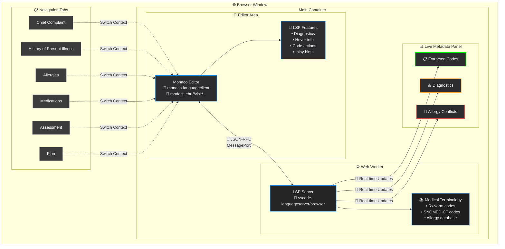

# yAbelFish

DNS: yabelfish.com

A Language Server Protocol (LSP) server designed for medical documentation using the yAbel format. yAbel is a lightweight, human-readable text format that combines the best of **Markdown** and **YAML** - but without being strict about either. This flexible approach allows clinicians to write natural, flowing medical notes while still maintaining enough structure for software to parse and analyze.

## 📝 What is yAbel?

yAbel is designed to be:
- **Markdown-inspired** for natural text flow and readability
- **YAML-influenced** for structured data when needed  
- **Forgiving and flexible** - not strict about syntax rules
- **Clinician-friendly** - prioritizes ease of writing over rigid formatting
- **Machine-parseable** - structured enough for intelligent software processing

Think of it as "Markdown with hints of YAML" where you can write naturally but add structure when it helps.

See: [yCard](https://github.com/mieweb/yCard) for more details on the yAbel format.
There are several standards coming including:
- yVisit
- yMedication
- yAllergy
- yProblem
- yImmunization
- yOrder
- yCard can be used for other domains as well but also yPatient, yPractitioner, yOrganization, etc.

yAbelFish is a web-based editor that leverages the Monaco Editor (the core of VS Code) and runs entirely in the browser using a Web Worker to host the LSP server. This means no backend is required, and all processing happens locally in the user's browser.

## Examples

[EXAMPLE.md](EXAMPLE.md)

### Obsolescence

We ultimately hope this tool becomes [obsolete](https://www.youtube.com/shorts/EjMEPLe1NC8)—superseded by ambient clinical intelligence where structured codes settle as a thin archaeological layer in the history of health tech. Until that future arrives, yAbelFish exists to make producing accurate, semi‑structured medical notes faster, safer, and less frustrating.

As [AR-assisted](https://youtu.be/EprwyLnDUFw) workflows (e.g. [Ozwell](https://ozwell.ai)-style AR glasses) and vector‑DB powered [WebChart](https://www.webchartnow.com) mature, real‑time semantic capture may remove the need for standalone LSP editors entirely. When that day comes, today’s manual coding friction—and the [moral injury](https://youtu.be/L_1PNZdHq6Q) caused by [poor UX](https://youtu.be/xB_tSFJsjsw?si=AjO-gL1l-bU-LmKh)—will just be another stratum of sediment. In the meantime, we focus on pragmatic tooling that helps clinicians now while paving a path toward that ambient, unobtrusive future.


## 🚀 Features

### Core Architecture
- **Universal LSP Server** - Core medical intelligence that can run anywhere
- **Multiple Deployment Options**:
  - **Browser (Offline)** - Monaco Editor + Web Worker LSP (no backend needed)
  - **VS Code Extension** - Native VS Code integration with LSP client
  - **Hosted Web Service** - Centralized LSP server for remote access
- **Medical Documentation UI** - Notebook-like interface where each visit section = a cell
- **Real-time Language Intelligence** with completions, hover info, diagnostics, and code actions
- **Kerberon Integration** - Testing framework for LSP validation and medical accuracy

### Medical Intelligence
- **Smart Completions** - Context-aware suggestions for medical terms based on current section
- **Code Normalization** - Right-click to normalize terms to standard codes (RxNorm, SNOMED-CT)
- **Inlay Hints** - Unobtrusive display of medical codes after recognized terms
- **Allergy Conflict Detection** - Real-time warnings for medication conflicts with patient allergies
- **Terminology Integration** - Built-in medical terminology with RxNorm and SNOMED-CT codes

### User Experience
- **Live Metadata Panel** - Shows extracted codes and diagnostics in real-time
- **VS Code-like Theme** - Familiar dark theme optimized for medical documentation
- **Instant Feedback** - No page reloads, all processing happens in real-time

## 🏗️ Architecture



## 📦 Technology Stack

### Core LSP Server
- **Language**: TypeScript
- **LSP Framework**: vscode-languageserver (universal)
- **Medical Data**: RxNorm, SNOMED-CT, ICD-10 terminology
- **Parser**: Custom yAbel format parser

### Browser Client
- **Frontend**: TypeScript + Vite
- **Editor**: Monaco Editor (VS Code core)
- **LSP Client**: monaco-languageclient
- **Worker Communication**: MessagePort/MessageChannel
- **Styling**: CSS (VS Code-inspired dark theme)

### VS Code Extension
- **Extension API**: VS Code Extension API
- **LSP Client**: vscode-languageclient
- **Language Support**: Custom yAbel language definition

### Web Server
- **Runtime**: Node.js
- **Framework**: Express.js (lightweight API)
- **Communication**: WebSocket for LSP protocol
- **Deployment**: Docker containerized

### Testing & Integration
- **Testing Framework**: Kerberon for medical document validation
- **Unit Tests**: Jest/Vitest
- **E2E Tests**: Playwright for browser scenarios

## 🚀 Quick Start

1. **Install dependencies**:
   ```bash
   npm install
   ```

2. **Start development server**:
   ```bash
   npm run dev
   ```

3. **Open browser** and navigate to `http://localhost:5173`

4. **Start documenting** - Click on different tabs to switch between sections and start typing medical terms

### ✨ What's Working Now

✅ **Phase 1 & 2 Complete!** 
- ✅ **yAbel Parser**: Intelligent parsing of medical documentation with section detection
- ✅ **ICD-10 Terminology**: Sample medical code database with 15+ common conditions & medications
- ✅ **Smart Completions**: Context-aware suggestions based on current section (medications, allergies, etc.)
- ✅ **Real-time Validation**: Example Allergy conflict detection (e.g., penicillin allergy vs amoxicillin prescription)
- ✅ **Monaco Editor**: Full VS Code-like editor with medical intelligence
- ✅ **Web Worker LSP**: LSP server running entirely in browser - no backend needed
- ✅ **Medical UI**: Tabbed interface for different visit sections
- ✅ **Live Metadata**: Real-time extraction of medical codes and diagnostics

### 🎯 Try These Features

1. **Switch Sections**: Click tabs to switch between Patient, Chief Complaint, HPI, Allergies, Medications, Assessment, Plan
2. **Smart Completions**: Type "chest" in Chief Complaint → get "chest pain" with ICD-10 code
3. **Allergy Detection**: Add "penicillin" to Allergies, then try "amoxicillin" in Medications → see conflict warning
4. **Code Recognition**: Type medical terms and see extracted codes in the right panel
5. **Real-time Intelligence**: Watch the metadata panel update as you type

## 🔧 Project Structure

```
yAbleFish/
├── 📦 packages/
│   ├── lsp-server/               # Core LSP server (universal)
│   │   ├── src/
│   │   │   ├── server.ts         # Main LSP server implementation
│   │   │   ├── medical/          # Medical terminology & validation
│   │   │   ├── parser/           # yAbel format parser
│   │   │   └── capabilities/     # LSP feature implementations
│   │   ├── package.json
│   │   └── tsconfig.json
│   │
│   ├── browser-client/           # Browser-based Monaco editor
│   │   ├── src/
│   │   │   ├── main.ts           # Monaco + LSP client setup
│   │   │   ├── worker/           # Web Worker LSP host
│   │   │   ├── ui/               # Medical documentation UI
│   │   │   └── themes/           # VS Code-inspired styling
│   │   ├── index.html            # Standalone web app
│   │   ├── package.json
│   │   └── vite.config.ts
│   │
│   ├── vscode-extension/         # VS Code extension
│   │   ├── src/
│   │   │   ├── extension.ts      # Extension entry point
│   │   │   ├── client.ts         # LSP client for VS Code
│   │   │   └── commands/         # VS Code-specific commands
│   │   ├── package.json          # Extension manifest
│   │   └── README.md
│   │
│   └── web-server/               # Hosted LSP server
│       ├── src/
│       │   ├── server.ts         # HTTP/WebSocket LSP server
│       │   ├── routes/           # API endpoints
│       │   └── middleware/       # CORS, auth, etc.
│       ├── package.json
│       └── Dockerfile
│
├── 🧪 test-environments/
│   ├── kerberon-integration/     # Kerberon testing setup
│   │   ├── samples/              # Sample yAbel documents
│   │   ├── test-cases/           # Kerberon test scenarios
│   │   ├── kerberon.config.json  # Kerberon configuration
│   │   └── README.md             # Testing instructions
│   │
│   ├── medical-samples/          # Real-world medical examples
│   └── performance/              # LSP performance benchmarks
│
├── 📚 docs/
│   ├── architecture.md           # System architecture
│   ├── yabel-format.md           # yAbel format specification
│   ├── deployment.md             # Deployment guides
│   └── api/                      # API documentation
│
├── 🔧 tools/
│   ├── build/                    # Build scripts and configs
│   ├── dev/                      # Development utilities
│   └── ci/                       # CI/CD configurations
│
├── package.json                  # Workspace root
├── tsconfig.json                 # Root TypeScript config
├── .github/                      # GitHub Actions workflows
└── README.md                     # This file
```

## 🎯 Usage Examples

### Basic Medical Documentation

1. **Chief Complaint**: Type "ear pain" - the system recognizes it and offers SNOMED codes
2. **HPI**: Add "2 days, fever" - get completions for symptoms and timeline
3. **Allergies**: Enter "penicillin" - system tracks this for conflict detection
4. **Medications**: Start typing "amoxicillin" - get warning about penicillin allergy conflict
5. **Assessment**: Document findings with ICD-10/SNOMED suggestions
6. **Plan**: Add treatment plans with medication suggestions

### Advanced Features

- **Code Actions**: Right-click any recognized term → "Normalize to SNOMED..." to add standard codes
- **Hover Information**: Hover over medical terms to see codes and definitions
- **Inlay Hints**: Medical codes appear automatically after recognized terms
- **Real-time Validation**: Allergy conflicts and other issues show immediately

## 📋 Available Commands

- `npm run dev` - Start development server with hot reload
- `npm run build` - Build for production
- `npm run preview` - Preview production build locally
- `npm test` - Run all tests (workspace tests + LSP integration tests)
- `npm run test:lsp` - Run comprehensive LSP tests (real server communication)
- `npm run lint` - Run ESLint code quality checks

## 🔮 Medical Terminology

### Current Coverage
- **RxNorm**: Common medications with codes
- **SNOMED-CT**: Conditions, symptoms, and clinical findings
- **Allergy Terms**: Common allergens with conflict detection

### Examples
- `amoxicillin 500 mg capsule` → `RxNorm:308191`
- `acute otitis media` → `SNOMED:65363002`
- `ear pain` → `SNOMED:16001004`
- `penicillin` → `RxNorm:7980` (allergy)

## 🛠️ Development

### Adding New Terminology
Edit `src/lsp.worker.ts` and add terms to the appropriate arrays:
- `rxnormCodes` - Medications
- `snomedCodes` - Conditions and symptoms  
- `allergyTerms` - Known allergens

### Adding New Rules
Implement validation logic in the `validateTextDocument` function in `src/lsp.worker.ts`.

### Customizing UI
Modify styles in `index.html` or add new sections by updating the tab structure and model creation.

## 🚧 Roadmap

### Phase 1: Core LSP Foundation 🏗️
- [x] **Tree-sitter WASM Parser** - ✅ Custom yAbel parser implemented with section detection
- [x] **ICD-10 Focus** - ✅ Comprehensive ICD-10 condition codes integration
  - [x] Code normalization for known conditions
  - [x] Warnings for unknown/invalid condition codes
  - [x] Diagnostic validation and suggestions
- [x] **IntelliSense/Auto-complete** - ✅ Smart completions for medical terms
  - [x] Context-aware ICD-10 suggestions
  - [x] Snippet completions for common medical patterns
  - [x] Real-time validation feedback

### Phase 2: Monaco Editor Integration 🖥️
- [x] **Browser Client Package** - ✅ Standalone Monaco editor with embedded LSP
- [x] **Web Worker Implementation** - ✅ LSP server running in browser worker
- [x] **Medical UI Components** - ✅ Tabbed interface for visit sections
- [x] **Offline Capability** - ✅ Full functionality without backend

### Phase 3: VS Code Extension & Server 🔌
- [ ] **Web Server LSP** - Hosted LSP service with WebSocket communication
- [ ] **VS Code Extension** - Native extension with LSP client integration
- [ ] **Multi-client Support** - Server handles multiple concurrent connections
- [ ] **Configuration Management** - User preferences and settings sync

### Phase 4: Testing & Quality Assurance 🧪
- [ ] **Kerberon Integration** - Automated testing framework setup
- [ ] **Medical Document Validation** - Test against real-world scenarios
- [ ] **Performance Benchmarking** - LSP response time optimization
- [ ] **End-to-End Testing** - Complete workflow validation

### Phase 5: CI/CD & Documentation 🚀
- [ ] **GitHub Actions Workflows** - Automated testing and deployment
- [ ] **Documentation Generation** - Auto-generated API docs and guides
- [ ] **Release Automation** - Version management and package publishing
- [ ] **Quality Gates** - Code coverage, linting, and security checks

### Future Enhancements 🔮
- [ ] **FHIR Export** - HL7 FHIR format export functionality
- [ ] **Extended Terminology** - RxNorm, SNOMED-CT, CPT codes
- [ ] **Voice Integration** - Speech-to-text for rapid documentation
- [ ] **Template System** - Customizable medical note templates
- [ ] **Multi-provider Support** - Collaborative documentation features


## 📄 License

MIT License - See LICENSE file for details

## 🤝 Contributing

1. Fork the repository
2. Create a feature branch
3. Make your changes
4. Test thoroughly
5. Submit a pull request

## 📞 Support

For questions or issues, please create an issue in the repository or contact the development team.

---

**Built with ❤️ for healthcare professionals**
