# yAbelFish

DNS: yabelfish.com


# yAbelFish

A Language Server Protocol (LSP) server designed medical documentation for the yAbel Fromat.  yAble is a lightweight, human-readable text format for capturing human-readable semi-structured notes optimized for medical visits.  It is meant to be easy to write and read by clinicians while still being structured enough for software to parse and analyze.

See: [yCard](https://github.com/mieweb/yCard) for more details on the yAbel format.
There are several standards coming including:
- yVisit
- yMedication
- yAllergy
- yProblem
- yImmunization
- yOrder
- yCard can be used for other domains as well but also yPatient, yPractitioner, yOrganization, etc.

yAbelFish is a web-based editor that leverages the Monaco Editor (the core of VS Code) and runs entirely in the browser using a Web Worker to host the LSP server. This means no backend is required, and all processing happens locally in the user's browser.


## 🚀 Features

### Core Architecture
- **Monaco Editor** (VS Code editor core) for rich text editing
- **LSP Server in Web Worker** - no backend required, everything runs in the browser
- **Notebook-like UI** where each visit section = a cell (Chief Complaint, HPI, Allergies, Medications, Assessment, Plan)
- **Real-time Language Intelligence** with completions, hover info, diagnostics, and code actions

### Medical Intelligence
- **Smart Completions** - Context-aware suggestions for medical terms based on current section
- **Code Normalization** - Right-click to normalize terms to standard codes (RxNorm, SNOMED-CT)
- **Inlay Hints** - Unobtrusive display of medical codes after recognized terms
- **Allergy Conflict Detection** - Real-time warnings for medication conflicts with patient allergies
- **Terminology Integration** - Built-in medical terminology with RxNorm and SNOMED-CT codes

### User Experience
- **Tabbed Interface** - Switch between different sections of the medical encounter
- **Live Metadata Panel** - Shows extracted codes and diagnostics in real-time
- **VS Code-like Theme** - Familiar dark theme optimized for medical documentation
- **Instant Feedback** - No page reloads, all processing happens in real-time

## 🏗️ Architecture

```mermaid
graph TB
    subgraph "Browser Window"
        subgraph "Header"
            A[Chief Complaint] 
            B[HPI] 
            C[Allergies] 
            D[Medications] 
            E[Assessment] 
            F[Plan]
        end
        
        subgraph "Main Container"
            subgraph "Editor Container"
                G["Monaco Editor (client)<br/>monaco-languageclient<br/>models: ehr://visit/..."]
                H["UI Features:<br/>• Diagnostics<br/>• Hover info<br/>• Code actions<br/>• Inlay hints"]
            end
            
            subgraph "Web Worker"
                I["LSP Server (browser)<br/>vscode-languageserver/browser"]
                J["Medical Terminology:<br/>• RxNorm codes<br/>• SNOMED-CT codes<br/>• Allergy terms"]
            end
            
            subgraph "Metadata Panel"
                K["Extracted Codes"]
                L["Diagnostics"]
                M["Conflicts"]
            end
        end
    end
    
    G <-->|JSON-RPC over<br/>MessagePort| I
    I --> J
    G --> H
    I -->|Updates| K
    I -->|Updates| L
    I -->|Updates| M
    
    A -.-> G
    B -.-> G
    C -.-> G
    D -.-> G
    E -.-> G
    F -.-> G
    
    style G fill:#2d2d30,stroke:#0078d4,color:#fff
    style I fill:#252526,stroke:#0078d4,color:#fff
    style J fill:#1e1e1e,stroke:#569cd6,color:#fff
    style K fill:#2d2d30,stroke:#00ff00,color:#fff
    style L fill:#2d2d30,stroke:#ff8c00,color:#fff
    style M fill:#2d2d30,stroke:#f14c4c,color:#fff
```



## 📦 Technology Stack

- **Frontend**: TypeScript + Vite
- **Editor**: Monaco Editor (VS Code core)
- **LSP**: monaco-languageclient + vscode-languageserver/browser
- **Communication**: MessagePort/MessageChannel for worker communication
- **Styling**: CSS (VS Code-inspired dark theme)

## 🚀 Quick Start

1. **Install dependencies**:
   ```bash
   npm install
   ```

2. **Start development server**:
   ```bash
   npm run dev
   ```

3. **Open browser** and navigate to `http://localhost:5173`

4. **Start documenting** - Click on different tabs to switch between sections and start typing medical terms

## 🔧 Project Structure

```
babelEditor/
├── src/
│   ├── main.ts           # Main application entry point
│   ├── lsp.worker.ts     # LSP server running in Web Worker
│   └── types.ts          # TypeScript type definitions (future)
├── index.html            # Main HTML page with UI
├── package.json          # Dependencies and scripts
├── tsconfig.json         # TypeScript configuration
├── vite.config.ts        # Vite build configuration
└── README.md            # This file
```

## 🎯 Usage Examples

### Basic Medical Documentation

1. **Chief Complaint**: Type "ear pain" - the system recognizes it and offers SNOMED codes
2. **HPI**: Add "2 days, fever" - get completions for symptoms and timeline
3. **Allergies**: Enter "penicillin" - system tracks this for conflict detection
4. **Medications**: Start typing "amoxicillin" - get warning about penicillin allergy conflict
5. **Assessment**: Document findings with ICD-10/SNOMED suggestions
6. **Plan**: Add treatment plans with medication suggestions

### Advanced Features

- **Code Actions**: Right-click any recognized term → "Normalize to SNOMED..." to add standard codes
- **Hover Information**: Hover over medical terms to see codes and definitions
- **Inlay Hints**: Medical codes appear automatically after recognized terms
- **Real-time Validation**: Allergy conflicts and other issues show immediately

## 📋 Available Commands

- `npm run dev` - Start development server with hot reload
- `npm run build` - Build for production
- `npm run preview` - Preview production build locally

## 🔮 Medical Terminology

### Current Coverage
- **RxNorm**: Common medications with codes
- **SNOMED-CT**: Conditions, symptoms, and clinical findings
- **Allergy Terms**: Common allergens with conflict detection

### Examples
- `amoxicillin 500 mg capsule` → `RxNorm:308191`
- `acute otitis media` → `SNOMED:65363002`
- `ear pain` → `SNOMED:16001004`
- `penicillin` → `RxNorm:7980` (allergy)

## 🛠️ Development

### Adding New Terminology
Edit `src/lsp.worker.ts` and add terms to the appropriate arrays:
- `rxnormCodes` - Medications
- `snomedCodes` - Conditions and symptoms  
- `allergyTerms` - Known allergens

### Adding New Rules
Implement validation logic in the `validateTextDocument` function in `src/lsp.worker.ts`.

### Customizing UI
Modify styles in `index.html` or add new sections by updating the tab structure and model creation.

## 🚧 Roadmap

### Near Term
- [ ] Tree-sitter WASM for robust parsing
- [ ] LocalStorage persistence for extracted codes
- [ ] Export to standard medical formats (HL7 FHIR)
- [ ] More comprehensive medical terminology

### Future Enhancements
- [ ] Voice-to-text integration
- [ ] Template-based documentation
- [ ] Integration with external medical APIs
- [ ] Multi-provider encounter support
- [ ] PDF/print formatting

## 🐛 Known Issues

- TypeScript compilation warnings (non-blocking)
- Limited medical terminology (proof-of-concept scope)
- No persistence between sessions (localStorage planned)

## 📄 License

MIT License - See LICENSE file for details

## 🤝 Contributing

1. Fork the repository
2. Create a feature branch
3. Make your changes
4. Test thoroughly
5. Submit a pull request

## 📞 Support

For questions or issues, please create an issue in the repository or contact the development team.

---

**Built with ❤️ for healthcare professionals**
